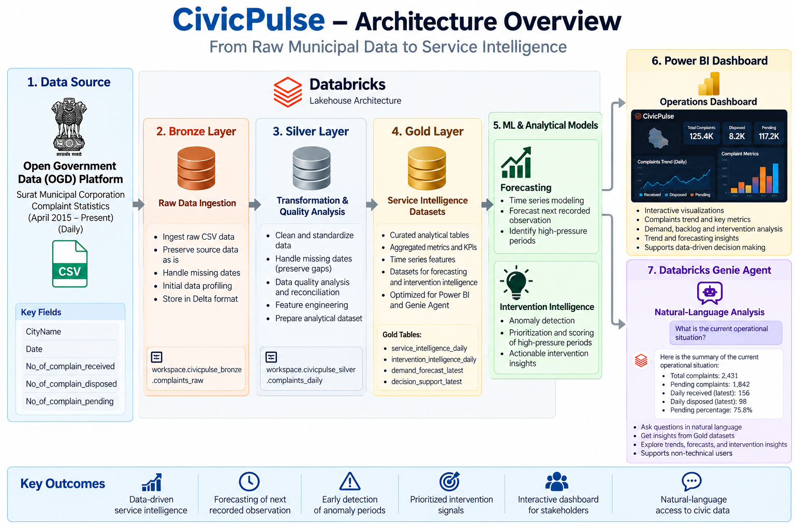

# CivicPulse

### AI-Powered Urban Service Intelligence Platform

CivicPulse is a data and AI platform for analyzing municipal complaint activity, detecting abnormal demand patterns, monitoring backlog pressure, forecasting complaint demand, and generating intervention-priority signals.

The project uses **Databricks, PySpark, Delta Lake, ML techniques, Power BI, and Databricks Genie** to transform raw civic-service data into operational intelligence.

---

## Overview

Municipal complaint data can contain useful signals about changing service demand and backlog pressure, but raw records alone do not provide an easy way to identify unusual activity or prioritize periods requiring closer attention.

CivicPulse addresses this by building an end-to-end analytics pipeline:

```text
Government Open Data
        │
        ▼
Bronze Layer
Raw ingestion + data-quality investigation
        │
        ▼
Silver Layer
Cleaning + transformation + derived metrics
        │
        ▼
Gold Layer
Service intelligence + anomaly detection
        │
        ├──────────────► Demand Forecasting
        │
        ├──────────────► Intervention Scoring
        │
        ▼
Power BI Dashboard
        │
        ▼
Databricks Genie Agent
Natural-language analysis
```
## Architecture



CivicPulse follows a medallion-style Databricks architecture, moving municipal complaint data from raw ingestion through transformation and quality analysis into curated Gold datasets. The Gold layer supports demand forecasting, anomaly and intervention intelligence, Power BI analytics, and natural-language exploration through Databricks Genie.

## Key Capabilities

- Municipal complaint demand analysis
- Backlog monitoring
- Data-quality and reconciliation analysis
- Historical demand profiling
- Rolling demand indicators
- Statistical anomaly detection
- Operational demand-surge detection
- Demand-surge persistence analysis
- Backlog pressure and persistence analysis
- Interpretable intervention-pressure scoring
- Leakage-safe demand forecasting
- Power BI operational dashboard
- Natural-language analysis using Databricks Genie

## Dataset

CivicPulse uses the **Surat City Complaint Statistics** dataset published through the Government of India's Open Government Data platform by Surat Municipal Corporation.

The source contains daily complaint statistics including:

- City
- Date
- Complaints received
- Complaints disposed
- Complaints pending

The dataset currently contains **3,371 recorded observations**, covering:

- **23 June 2017 – 24 September 2026**

The source contains **10 missing calendar dates**. These dates are preserved as missing observations rather than being filled with zero complaints.

## Project Documentation

- [System Architecture](docs/architecture.png)
- [Genie Agent Documentation](docs/genie_agent.md)
- [Power BI Dashboard](powerbi/README.md)
- [Dataset Documentation](data/README.md)

## Technology Stack

| Layer | Technology |
|---|---|
| Data Platform | Databricks |
| Processing | Apache Spark / PySpark |
| Storage | Delta Lake |
| Querying | Spark SQL |
| Machine Learning | PySpark ML |
| Forecasting | Historical moving-average baseline |
| Visualization | Power BI |
| AI / Natural Language | Databricks Genie |
| Language | Python, SQL |
| Version Control | Git / GitHub |

## Data Architecture

### Bronze Layer

The Bronze layer ingests the original CSV data into:

```text
workspace.civicpulse_bronze.complaints_raw
```

The layer preserves the source data while performing initial profiling and data-quality investigation.

#### Bronze Checks

- Schema inspection
- Row and column counts
- Null-value analysis
- Date coverage
- Numeric range profiling
- Duplicate/date checks
- Pending-count reconciliation investigation

### Reconciliation Investigation

An assumed relationship was tested:

```text
expected_pending =
previous_pending
+ complaints_received
- complaints_disposed
```

The source-reported pending values were not corrected using this formula.

Instead, the difference is recorded as:

```text
reconciliation_gap
```

This preserves the original source semantics while making the data-quality behavior visible to downstream analysis.

### Silver Layer

The transformed Silver dataset is stored as:

```text
workspace.civicpulse_silver.complaints_daily
```

The Silver layer standardizes the source column names and derives analytical fields including:

- `previous_pending`
- `pending_change`
- `net_complaint_flow`
- `expected_pending`
- `reconciliation_gap`
- `reconciliation_status`

The Silver layer provides the foundation for subsequent analytical and machine-learning features.

### Gold Layer

The Gold layer converts the transformed data into decision-oriented analytical datasets.

Current Gold tables include:

```text
workspace.civicpulse_gold
├── service_intelligence_daily
├── intervention_intelligence_daily
├── demand_forecast_latest
└── decision_support_latest
```

## Service Intelligence

The service-intelligence layer contains rolling demand and backlog indicators such as:

- 7-observation complaint averages
- 30-observation complaint averages
- Recent maximum backlog
- Demand-surge ratios
- Demand pressure
- Backlog pressure
- Complaint disposal activity ratios

The analysis uses recorded observations, rather than assuming that missing calendar dates represent zero activity.

## Anomaly Detection

CivicPulse uses a historical, past-only baseline to identify unusual complaint demand.

The demand Z-score is calculated from the previous 30 recorded observations.

### Operational Surge

An observation is classified as `OPERATIONAL_SURGE` when:

```text
demand_z_score >= 3
AND
complaints_received >= 314
```

The threshold of **314 complaints** corresponds to the historical 95th percentile of recorded complaint demand.

This separates operationally meaningful high-volume surges from statistically unusual observations with very small absolute volumes.

### Demand Persistence

CivicPulse also evaluates whether operational surges are isolated or persistent.

Using the previous 7 recorded observations:

| Previous operational surges | Classification |
|---:|---|
| 2 or more | `SUSTAINED` |
| 1 | `RECENT_SURGE` |
| 0 | `NO_RECENT_SURGE` |

This provides additional context beyond a single-day anomaly.

## Backlog Pressure

Backlog pressure is evaluated using the historical 95th percentile of reported pending complaints.

```text
BACKLOG_P95 = 8,950
```

A record is considered under current backlog pressure when:

```text
complaints_pending >= 8,950
```

Backlog persistence is separately calculated using the previous 7 recorded observations.

This allows CivicPulse to distinguish between:

```text
Current Pressure
        +
Historical Persistence
```

rather than treating every high backlog observation identically.

## Intervention Intelligence

CivicPulse combines demand intensity, backlog intensity, and persistence signals into an interpretable intervention-pressure score.

The score combines four normalized components:

```text
Demand Intensity
+
Backlog Intensity
+
Demand Persistence
+
Backlog Persistence
```

The resulting score ranges from **0–100**.

### Intervention Bands

| Score | Band |
|---:|---|
| < 25 | `LOW` |
| 25–49.99 | `ELEVATED` |
| 50–69.99 | `HIGH` |
| ≥ 70 | `VERY_HIGH` |

The intervention score is an interpretable heuristic prioritization signal. It is not a probability and is not a calibrated risk model.

The project also maintains a separate `pressure_state` field so that the continuous score and rule-based operational state can be interpreted independently.

## Demand Forecasting

CivicPulse evaluates simple forecasting approaches using chronological train/validation/test periods.

A naive previous-observation baseline was compared with a 7-observation moving-average baseline.

### Test Results

| Forecasting Method | MAE | RMSE |
|---|---:|---:|
| Previous-observation baseline | 57.49 | 75.90 |
| 7-observation moving average | 49.12 | 71.74 |

The 7-observation moving average was retained as the current forecasting baseline because it performed better on the held-out test period.

The forecast represents the next recorded observation, not necessarily the next calendar day, because the source contains missing dates.

## Power BI Dashboard

CivicPulse includes a three-page Power BI dashboard.

### 1. Operations Overview

Provides:

- Current complaints
- Current backlog
- Intervention pressure
- Next-observation forecast
- Current operational situation
- Complaint demand trend
- Backlog trend

### 2. Demand & Anomaly Intelligence

Provides:

- Demand anomaly classification
- Operational demand surges
- Surge persistence
- Operational surge event details
- Demand Z-scores

### 3. Intervention Intelligence

Provides:

- Intervention pressure distribution
- High-priority intervention events
- Backlog persistence
- Priority event details
- Current demand Z-score
- Forecast change
- Current intervention band
- Current decision signal

## Databricks Genie Agent

CivicPulse also includes a Databricks Genie Agent configured over the curated Gold datasets.

The agent can answer natural-language questions about:

- Current operational conditions
- Historical demand surges
- Intervention-pressure events
- Backlog pressure
- Forecast outputs
- Anomaly classifications
- Historical trends

The agent is constrained to the CivicPulse Gold data and defined business logic rather than inventing operational causes or facts that are not present in the dataset.

### Example Questions

- What is the current operational situation?
- Why was a particular date classified as an operational surge?
- Which dates had the highest intervention pressure scores?
- What is the latest complaint demand forecast?
- What operational conditions were present during recent demand surges?

## Current Example Output

The latest available observation in the current CivicPulse pipeline is:

| Metric | Value |
|---|---:|
| Date | 24 September 2026 |
| Complaints Received | 1,055 |
| Complaints Pending | 10,566 |
| Demand Z-Score | 6.24 |
| Anomaly Type | `OPERATIONAL_SURGE` |
| Surge Persistence | `SUSTAINED` |
| Pressure State | `CRITICAL_COMBINED_PRESSURE` |
| Intervention Score | 78.57 |
| Intervention Band | `VERY_HIGH` |
| Next-Observation Forecast | 412.57 |

The forecast should be interpreted as a model output based on historical recorded observations rather than as a guaranteed future value.

## Project Structure

```text
CivicPulse/
│
├── README.md
├── .gitignore
│
├── data/
│   └── README.md
│
├── docs/
│   ├── architecture.png
│   └── genie_agent.md
│
├── notebooks/
│   ├── 01_bronze_ingestion.ipynb
│   ├── 02_silver_quality_analysis.ipynb
│   └── 03_ml_feature_engineering.ipynb
│
└── powerbi/
    ├── README.md
    ├── operations_overview.png
    ├── demand_anomaly_intelligence.png
    └── intervention_intelligence.png
```

## Key Engineering Decisions

### Preserve Source Semantics

Reported pending values are preserved rather than being artificially corrected using an assumed accounting relationship.

### Avoid Data Leakage

Forecasting features use historical observations only. Current-day complaint values are not used to construct features intended to predict that same observation.

### Chronological Evaluation

Forecasting models are evaluated using chronological train, validation, and test periods rather than random splitting.

### Distinguish Statistical and Operational Anomalies

A high statistical Z-score alone does not necessarily indicate meaningful operational volume. CivicPulse combines statistical abnormality with an absolute demand threshold.

### Separate Pressure State from Intervention Score

The rule-based pressure state explains the observed condition, while the continuous intervention score provides a prioritization signal.

## Limitations

- The dataset represents reported municipal complaints and does not contain detailed incident-level information.
- Missing calendar dates are present in the source.
- The meaning of the reported `complaints_pending` field does not consistently follow the assumed received/disposed flow relationship.
- The intervention score is a heuristic and is not a calibrated probability.
- Forecasts represent the next recorded observation rather than guaranteed calendar-day forecasts.
- The available data does not establish causal explanations for demand surges or backlog changes.
- Operational causes, staffing conditions, department-level information, and geographic incident details are not available in the current dataset.

## Future Extensions

Potential extensions include:

- Streaming complaint ingestion
- Additional government datasets
- Weather and environmental context
- Geographic service-area analysis
- Incident-level complaint categorization
- More advanced forecasting models
- Model monitoring and drift detection
- Automated data-quality monitoring
- Custom FastAPI interface for the intelligence layer
- Agentic workflows for multi-step operational analysis

## Author

**Ishan Pote**

Computer Science — Data Science

Built as an end-to-end data engineering, machine learning, and AI project using Databricks and open government data.
